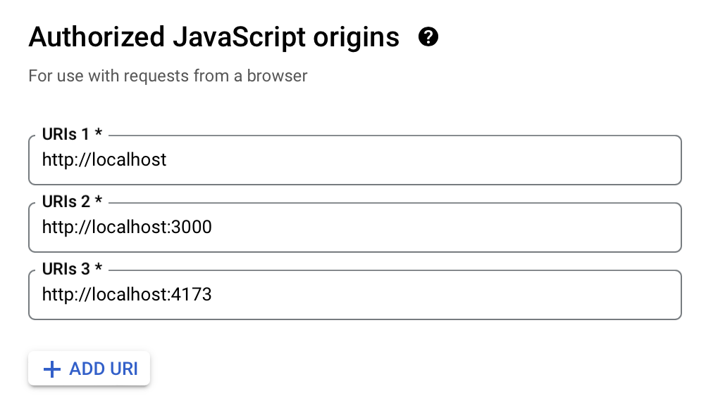
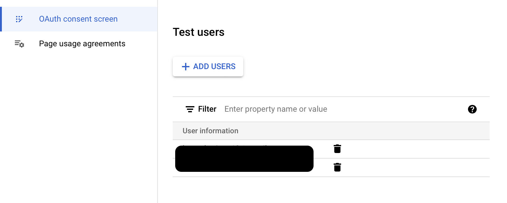

# Enabling Google SSO
To quickly get the project running, the minimal config in the
[quick start](quickstart.md) disables authentication and
authorization generally, including Google SSO.

This doc will go through the process of enabling it.

## Getting OAuth Client ID
A Google OAuth client ID is needed to enable SSO on the frontend.

1. Follow [these instructions](
    https://support.google.com/cloud/answer/6158849?hl=en) on
    setting up OAuth on Google Cloud Platform (GCP).

    For **Authorized JavaScript origins** type in `http:localhost`. If your
    frontend is running on a port different port, be sure to specify it. E.g.,

    

1. Navigate to the **OAuth consent screen** setting to add test users

    

1. Update your `.env` as follows

    ```ini
    REQUIRE_AUTH=True
    VITE_REQUIRE_AUTH=${REQUIRE_AUTH}
    VITE_GOOGLE_CLIENT_ID="Your client ID here"
    ```
1. Run `make super` to create a Django admin super user.

    The username and email must match the test users added above.
    The password here is for the [Django admin site](./django.md)
    and _does not need to match_ the Google account. For testing and
    development purposes it can literally be `password` (Django will
    complain though)

1. Run `make restart` to apply the new `.env` to the containers

Navigate to [localhost](http://localhost) in your browser after
the containers restart. Barring any issues, you should be presented
with a login screen with a "Sign in with Google" button.

When signing in, remember to use the _Google account password_ **NOT** the
Django admin password just created above.
