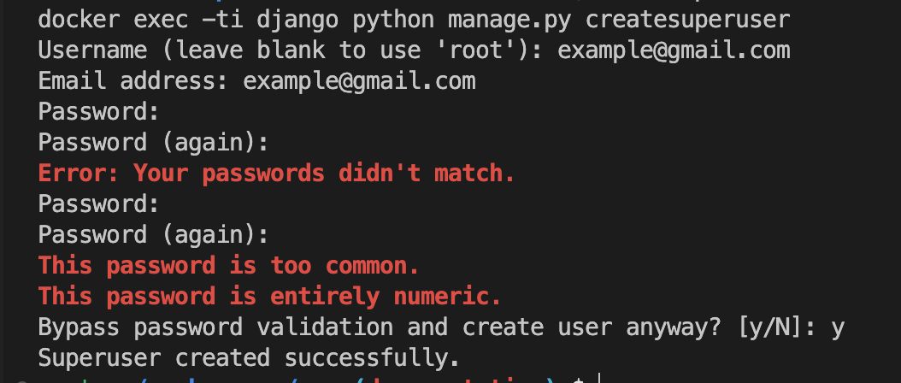
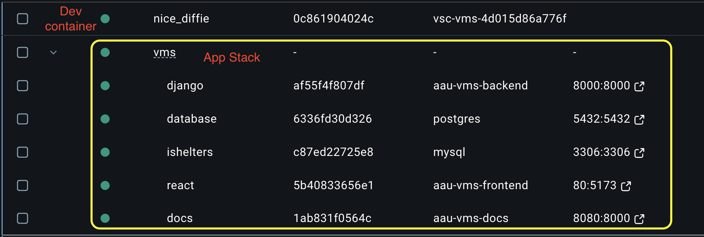

(quick_start)=
# Quick Start

Assuming you have the [perquisites](./dev.md#perquisites) installed, first things first
is to create a minimal environment file (`.env`). This file defines environment variables
that are accessible from any process.

1. Open the project in VS Code
1. Install the [Dev Containers extension](https://marketplace.visualstudio.com/items?itemName=ms-vscode-remote.remote-containers) if it is not already installed.
1. In the root folder, create a file named `.env`
1. Copy and paste the [minimal env config](#minimal-environment-file) and input values for the required options
1. Open VS Code Command Palette
1. Type in `Dev Containers` and select **"Reopen in Container"**

Barring any issues, this will:

- pull and build all the necessary image
- bring up the development stack (db, django, react, dummy ishelters, and docs)
- initialize the databases (create tables & load dummy data)
- prompt for Django's default super user

    

Depending on your PC, the first time launch can take a while. Once it is complete,
check Docker Desktop. All services under `angel-among-us-vms` should be green (running).



In your browser visit [localhost](http://localhost) and _voilà_
You are now ready to make changes to the code.

From here, you can

* Check out [the overview page](../overview.rst) to understand how the code is organize
* [Enable Google SSO](../admin/sso.md)
* View the [interactive REST APIs](http://localhost:8000)
* View the [Django admin site](http://localhost:8000/admin) ([docs](../admin/django.md))
* Familiarize yourself with the [available make targets](../admin/make.md)
* Check out how to [access container applications and services](./containers.md)
* Run through a [tutorial of making changes](../tutorial.md)

Happy coding!!

(minimal_env)=
## Minimal Environment File
Below is the minimal configuration needed to properly bring the application
stack on. Check out the [configuration page](../admin/config.md) for a complete
list of available options.

```ini
# You can use https://djecrety.ir to generate a key
SECRET_KEY=

# Application database
POSTGRES_USER=
POSTGRES_PASSWORD=

# Dummy iShelters
ISHELTERS_USERNAME=
ISHELTERS_PASSWORD=

DEBUG=True
ALLOWED_HOSTS=*
DJANGO_PORT=8000
REQUIRE_AUTH=False
ETL_EMAIL_REPORT=False
CORS_ALLOW_ALL_ORIGINS=True
VITE_REQUIRE_AUTH=${REQUIRE_AUTH}
VITE_JSON_SERVER_URL=http://localhost:${DJANGO_PORT}
```

```{admonition} Note
This minimal quick start disables Google SSO
and puts the app in read-only mode, regardless
of assigned role.
```